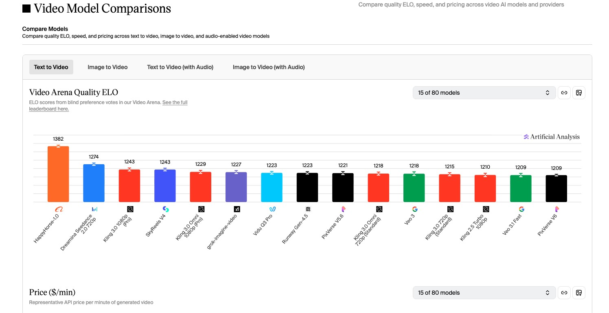

# HappyHorse 1.0: What We Know About Alibaba’s New AI Video Model

A simple guide to HappyHorse 1.0, the new AI video model that quickly drew attention after ranking above several major video models on Artificial Analysis. Alibaba later said the model belongs to its ATH unit and is still in testing, with access still limited for now. 

---

## 🎬 Table of Contents

- [Introduction](#introduction)
- [What Is HappyHorse 10](#what-is-happyhorse-10)
- [Why It Got Attention So Fast](#why-it-got-attention-so-fast)
- [What Seems Confirmed](#what-seems-confirmed)
- [Reported Features](#reported-features)
- [Video Examples](#video-examples)
- [Why Developers Care](#why-developers-care)
- [HappyHorse 1.0 vs Other Video Models](#happyhorse-10-vs-other-video-models)
- [What Is Still Unclear](#what-is-still-unclear)
- [The Open-Source Question](#the-open-source-question)
- [FAQ](#faq)
- [Sources](#sources)
- [Final Thoughts](#final-thoughts)

---

## Introduction

HappyHorse 1.0 is one of the most talked-about AI video models right now.

It got attention fast because it appeared near the top of the Artificial Analysis video leaderboard and ranked above several well-known models, including Seedance 2.0 and Kling 3.0. 

Soon after, Alibaba said HappyHorse belongs to its ATH unit. Public reporting also says the model entered public testing this week, but it is still not open to all regular users. Access appears limited for now. 

That mix of strong rankings, limited access, and unusual technical claims is why so many people are watching it.

---

## What Is HappyHorse 1.0?

HappyHorse 1.0 is a new AI video generation model linked to Alibaba. Based on public reporting, it is designed for both text-to-video and image-to-video generation. 

What makes it stand out is not only image quality. Many reports describe it as a model built to handle video and audio together, instead of making video first and adding sound later. 

That is a big reason people see it as more than just another leaderboard entry.

---

## Why It Got Attention So Fast

HappyHorse did not follow a normal launch path.

It did not begin with a large public launch, a normal product page, or a widely available API. Instead, it drew attention because of its performance on Artificial Analysis, where it appeared as a top-ranked video model. 

That made people ask the same questions right away:

- What is this model?
- Who built it?
- How is it ranking so high?
- When will people actually be able to use it?

Alibaba later confirmed that the model belongs to its ATH team, but many parts of the release plan are still unclear. 

---

## What Seems Confirmed

Based on public sources, a few things already look clear.

### 1. HappyHorse 1.0 appears on Artificial Analysis
HappyHorse 1.0 appears on Artificial Analysis video model pages and leaderboard views. 

### 2. It ranked above several major models
On public leaderboard pages, HappyHorse ranked above major names such as Seedance 2.0 and Kling 3.0. That is the main reason it spread so quickly online. 

### 3. Alibaba claimed the model
Alibaba later said HappyHorse belongs to its ATH unit. Reports also said the model was not fully public at that stage. 

### 4. Access is still limited
Current information suggests the model has started public testing, but it is not yet open to the general public. Access still appears restricted. 

---

## Reported Features

Some features are widely reported, but not all of them have been fully documented in a detailed official public release. Because of that, it is safer to treat this section as **reported capabilities**, not final confirmed specs.

### Text-to-video and image-to-video
Multiple public descriptions say HappyHorse supports both text-to-video and image-to-video workflows. 

### Joint audio-video generation
This is one of the most interesting claims. Public writeups describe HappyHorse as a system that can generate sound and video together in one shared model path. That means speech, sound effects, and scene audio may be produced in sync with the video itself, instead of being added later. 

### Fast inference
Several public descriptions say the model uses a short denoising path and is built for fast inference. Some reports mention about 38 seconds to create a 5-second 1080p clip on H100 hardware. 

### 1080p output
Public materials tied to the model describe native 1080p output. 

### Multi-language lip sync
Some public descriptions also say HappyHorse supports lip sync across seven languages, including English, Mandarin, Cantonese, Japanese, Korean, German, and French. 

---

## Video Examples

To make this page more concrete, here are several comparison videos shared by Artificial Analysis. These samples show how HappyHorse 1.0 performs against other leading video models on prompts that test sound, motion, lighting, and story clarity. 

| Type | Compared Models | Prompt | Video |
|---|---|---|---|
| Multi-model comparison | HappyHorse-1.0, Dreamina Seedance 2.0, Kling 3.0 Pro, grok-video-imagine, PixVerse V6 | A basketball bouncing on an empty indoor court, creating a loud, rhythmic echo with every slap against the polished hardwood floor, punctuated by the sharp squeak of rubber sneakers. | <video src="https://github.com/user-attachments/assets/1ea11e7c-8541-47dc-889f-22ca0bf3936f" controls width="700"></video> |
| Multi-model comparison | HappyHorse-1.0, Dreamina Seedance 2.0, Kling 3.0 Pro, grok-video-imagine, PixVerse V6 | A flashlight beam exploring a cave system, illuminating wet limestone formations. The light catches crystalline calcite deposits that glitter and flash. Where the beam passes through shallow standing water, it creates bright caustic patterns on the submerged floor. Stalactites cast long, swinging shadows as the flashlight moves. **Audio:** Dripping water echoing, footsteps on wet rock, breathing in enclosed space. | <video src="https://github.com/user-attachments/assets/97958925-70dc-4232-a347-5087e873c2a2" controls width="700"></video> |
| Multi-model comparison | HappyHorse-1.0, Dreamina Seedance 2.0, Kling 3.0 Pro, grok-video-imagine, PixVerse V6 | A Pixar-style short about a nervous little traffic cone who dreams of being a finish line pylon at a major race. Other cones mock its ambitions. A construction worker accidentally places it at a marathon finish line. The cone's painted face shifts from terror to joy as runners pass. Confetti falls on its cone head. Other cones watch on TV, inspired. **Audio:** Traffic sounds becoming crowd cheers, inspirational swelling music. | <video src="https://github.com/user-attachments/assets/ab23bfac-52b9-499d-b3a5-833aa28718c8" controls width="700"></video> |

> Note: All examples in this section are multi-model comparison videos rather than HappyHorse-only samples.

---

## Why Developers Care

HappyHorse matters for more than rankings.

If the reported feature set is real in broad public use, it could matter for both creators and developers.

### For creators
A model that handles video and sound together could remove extra editing steps. That means less time spent syncing dialogue, fixing sound, or building separate audio layers after generation.

### For developers
A model like this could matter in three ways:

- it may push video AI closer to full multimodal generation
- it may raise the standard for motion, speech, and sound together
- it may become a strong base for future tools, products, and research

That is especially true if Alibaba later opens access more widely or releases deeper technical materials. 

---

## HappyHorse 1.0 vs Other Video Models

HappyHorse is getting attention because it is not competing with weak models. It is showing up in the same conversation as the strongest names in AI video.

### Compared with Seedance 2.0
HappyHorse appeared above Seedance 2.0 on the relevant Artificial Analysis leaderboard views. That does not prove it wins in every use case, but it does explain why people noticed it so quickly. 

### Compared with Kling 3.0
Kling 3.0 remains one of the most recognized names in AI video. HappyHorse ranking above it on public leaderboard snapshots is a major signal. 

### Compared with models that add audio later
Many video systems either skip audio or create it in a separate step. HappyHorse is being discussed as a model that may handle both in one unified path, which would be a real difference if it holds up in large-scale public testing. 

---

## What Is Still Unclear

This is where people should be careful.

A lot of the excitement around HappyHorse comes from reported details, not from a full public product release. Several important questions are still open:

- When will full public access begin?
- Will there be an official API?
- Will Alibaba release weights or code?
- What license would apply if anything is released?
- How much hardware is needed for serious local deployment?
- How well does the model perform outside leaderboard tests in real production use?

These questions matter because they decide whether HappyHorse becomes only a strong demo, or a widely used platform for creators and builders.

---

## The Open-Source Question

One of the biggest rumors around HappyHorse is that it may eventually be released more openly, possibly with weights, code, or related modules.

That idea has spread fast because it would be a huge moment for AI video. A more open release could let developers run the model locally, fine-tune it, study the architecture, and integrate it into their own products.

But this part should be treated carefully.

As of now, public reporting clearly supports that Alibaba claimed the model and that it is in testing. What is less clear is the final scope of any future release, including open-source terms, license details, and what exactly would be made available. 

So for now, the safer view is simple:

**HappyHorse may become more open later, but developers should not treat that as final yet.**

---

## FAQ

### Is HappyHorse 1.0 public now?
Not fully. Current reporting suggests it has entered public testing, but it is still not open to all regular users. Access appears limited for now. 

### Who made HappyHorse 1.0?
Alibaba later said the model belongs to its ATH unit. 

### Does it support audio?
Public reports say HappyHorse can generate video and audio together in one model path, but detailed official technical documentation is still limited. 

### Does it support text-to-video and image-to-video?
Multiple public sources describe HappyHorse as supporting both workflows. 

### Is it better than Seedance 2.0 or Kling 3.0?
HappyHorse ranked above both on the relevant Artificial Analysis leaderboard views that drew public attention. That said, leaderboard position is not the same as winning every real-world use case. 

### Is HappyHorse open source?
That is still unclear. There is strong discussion around a possible more open release, but the final details are not confirmed in a full public technical release. 

---

## Sources

- HappyHorse X: https://x.com/HappyHorseATH
- Artificial Analysis Video Arena: https://artificialanalysis.ai/video/arena
- Artificial Analysis leaderboard and model pages for HappyHorse 1.0. 
- Public reporting on Alibaba claiming the model and describing limited access. 
- Public writeups describing reported capabilities such as joint audio-video generation, 1080p output, and multilingual lip sync. 
- Artificial Analysis comparison examples on X:
  - https://x.com/ArtificialAnlys/status/2042468647256670467?s=20
  - https://x.com/ArtificialAnlys/status/2042468720732488173?s=20
  - https://x.com/ArtificialAnlys/status/2042468581066359203?s=20

---

## Final Thoughts

HappyHorse 1.0 moved from mystery to headline very fast.

Its ranking success is already visible in public. Alibaba has claimed the model. Testing has started, but normal users still do not appear to have broad access yet. 

That leaves HappyHorse in a very interesting place.

It is already important enough to watch.  
It is not yet open enough to judge fully.  
And its biggest next step is clear: broader access, clearer documentation, and proof that its strongest claims hold up in real public use.

If that happens, HappyHorse 1.0 may become more than a surprise leaderboard winner. It may become one of the models that changes what people expect from AI video.
